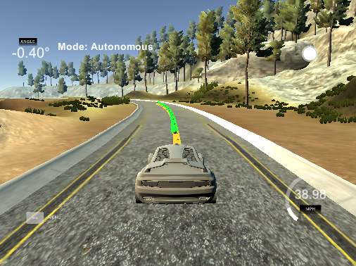

# CarND-Controls-MPC
Self-Driving Car Engineer Nanodegree Program

---

## Dependencies

* cmake >= 3.5
 * All OSes: [click here for installation instructions](https://cmake.org/install/)
* make >= 4.1(mac, linux), 3.81(Windows)
  * Linux: make is installed by default on most Linux distros
  * Mac: [install Xcode command line tools to get make](https://developer.apple.com/xcode/features/)
  * Windows: [Click here for installation instructions](http://gnuwin32.sourceforge.net/packages/make.htm)
* gcc/g++ >= 5.4
  * Linux: gcc / g++ is installed by default on most Linux distros
  * Mac: same deal as make - [install Xcode command line tools]((https://developer.apple.com/xcode/features/)
  * Windows: recommend using [MinGW](http://www.mingw.org/)
* [uWebSockets](https://github.com/uWebSockets/uWebSockets)
  * Run either `install-mac.sh` or `install-ubuntu.sh`.
  * If you install from source, checkout to commit `e94b6e1`, i.e.

```
    git clone https://github.com/uWebSockets/uWebSockets
    cd uWebSockets
    git checkout e94b6e1
```

    Some function signatures have changed in v0.14.x. See [this PR](https://github.com/udacity/CarND-MPC-Project/pull/3) for more details.

* **Ipopt and CppAD:** Please refer to [this document](https://github.com/udacity/CarND-MPC-Project/blob/master/install_Ipopt_CppAD.md) for installation instructions.
* [Eigen](http://eigen.tuxfamily.org/index.php?title=Main_Page). This is already part of the repo so you shouldn't have to worry about it.
* Simulator. You can download these from the [releases tab](https://github.com/udacity/self-driving-car-sim/releases).
* Not a dependency but read the [DATA.md](./DATA.md) for a description of the data sent back from the simulator.


## Basic Build Instructions

1. Clone this repo.
2. Make a build directory: `mkdir build && cd build`
3. Compile: `cmake .. && make`
4. Run it: `./mpc`.

***

## Implementation
### Kinematic Model
In this assignment, kinematic model is used. This is known as the simple but powerful modeling without modeling cornering force.

$x[t] = x[t-1] + v[t-1]  \cos(\psi[t-1])  dt$  
$y[t] = y[t-1] + v[t-1]  \sin(\psi[t-1])  dt$  
$\psi[t] = \psi[t-1] + \frac{v[t-1] \delta[t-1] dt}{L_f}$  
$v[t] = v[t-1] + a[t-1] dt$  
$cte[t] = f(x[t-1]) - y[t-1] + v[t-1] \sin(\epsilon[t-1]) dt$  
$\epsilon[t] = \psi[t] - \psi_{des}[t-1] + \frac{v[t-1] \delta[t-1] dt}{L_f}$  

Where:
$x, y$ ... Position of the car in 2D coordinate  
$\psi$ ... Heading angle of the car  
$v$ ... Velocity of the car  
$cte$ ... Cross track error  
$epsi$ ... Orientation error  
$L_f$ ... Distance between the car center of gravity and front wheels (along with x-axis)  

Based on this model, next control information will be calculated using optimization algorithm.  
$a$ ... Acceleration of the car (throttle)  
$\delta$ ... Input steering control  


### Hyperparameter of the model 
$N$ ... The number of points used for prediction horizon.  
$dt$ ... time interval between each point  

If you chose $N*dt$ too large, prediction won't be precise as the far future has more unstability. And if $N*dt$ is too small, trajectory will be overfitted.
I used several parameters, starting from $N = 25, dt = 0.1$. But the output was unstable, thus I reduce $N$ to 15.

### Path planning using polynomial fitting
We assume waipoints as known point given in 2D coordainte system. At first, these points are transformed into car-relative coordinate system.

Then, waypoints are approximated by 3rd-degree polynomial. $cte$ and $\epsilon$ can be calulated based on this approximation.

### Calculate cost function and optimize
Cost function is calculated using weighted sum of plural conditions.

#### Weighted sum of the error function
Below 7 different cost is considered.

1. $cte$
2. $\epsilon$
3. difference from target vehicle, to avoid stucking
4. throttle value itself, to avoid too drastic accerleration / breaking
5. steering value itself, to avoid too drastic steering
6. difference of throttle value from previous state
7. difference of steering vlaue from previous state

In order to balance between them, trial error is conducted. Especially, weight `1,2` should be reduced to unstable input (vehicle oscilates around reference trajectory).

```cpp
    // The part of the cost based on the reference state.
    for (unsigned int t = 0; t < N; t++) {
      fg[0] += cte_weight * CppAD::pow(vars[cte_start + t], 2);
      fg[0] += epsi_weight * CppAD::pow(vars[epsi_start + t], 2);
      fg[0] += v_weight * CppAD::pow(vars[v_start + t] - ref_v, 2);
    }

    // Minimize the use of actuators.
    for (unsigned int t = 0; t < N - 1; t++) {
      fg[0] += delta_weight * CppAD::pow(vars[delta_start + t], 2);
      fg[0] += a_weight * CppAD::pow(vars[a_start + t], 2);
    }

    // Minimize the value gap between sequential actuations.
    for (unsigned int t = 0; t < N - 2; t++) {
      fg[0] += delta_change_weight * CppAD::pow(vars[delta_start + t + 1] - vars[delta_start + t], 2);
      fg[0] += a_change_weight * CppAD::pow(vars[a_start + t + 1] - vars[a_start + t], 2);
    }
```

#### Physical Limitation
Vehicle cannot change its steering and speed in the road scene.

```cpp
  // The upper and lower limits of delta are set to -25 and 25
  // degrees (values in radians).
  // NOTE: Feel free to change this to something else.
  for (unsigned int i = delta_start; i < a_start; i++) {
    vars_lowerbound[i] = -0.436332;
    vars_upperbound[i] = 0.436332;
  }

  // Acceleration/decceleration upper and lower limits.
  // NOTE: Feel free to change this to something else.
  for (unsigned int i = a_start; i < n_vars; i++) {
    vars_lowerbound[i] = -1.0;
    vars_upperbound[i] = 1.0;
  }
```

#### Latency Handle
In the real system, actuator cannot avoid latecy from signal input to its actuation. Thus, the system will do the optimization based on the predicted state vector. In this assignment, latency is assumed to be $dt = 0.1s$. Following code does the optimization based on predicted state.

```cpp
// Predict state after latency
// x, y and psi are all zero after transformation above
const double Lf = 2.67;
const double dt = 0.1;

double pred_px = 0.0 + v*cos(epsi) * dt; 
double pred_py = 0.0 + v*sin(epsi) * dt ;
double pred_psi = 0.0 + v * -delta * dt / Lf;
double pred_v = v + a * dt;
double pred_cte = cte + v * sin(epsi) * dt;
double pred_epsi = epsi - v * atan(coeffs[1]) * dt / Lf;

Eigen::VectorXd state(6);
state << pred_px, pred_py, pred_psi, pred_v, pred_cte, pred_epsi;

auto vars = mpc.Solve(state, coeffs);
```

## Output Example
#### Capture Image

#### Capture Movie
[movie captured](./output/output.mp4)